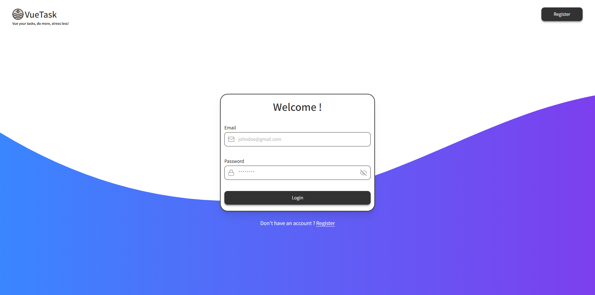
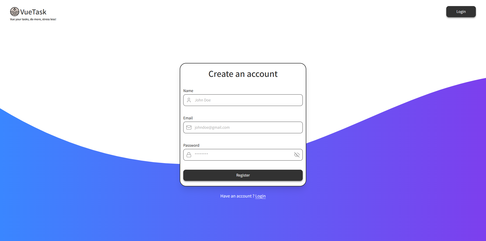
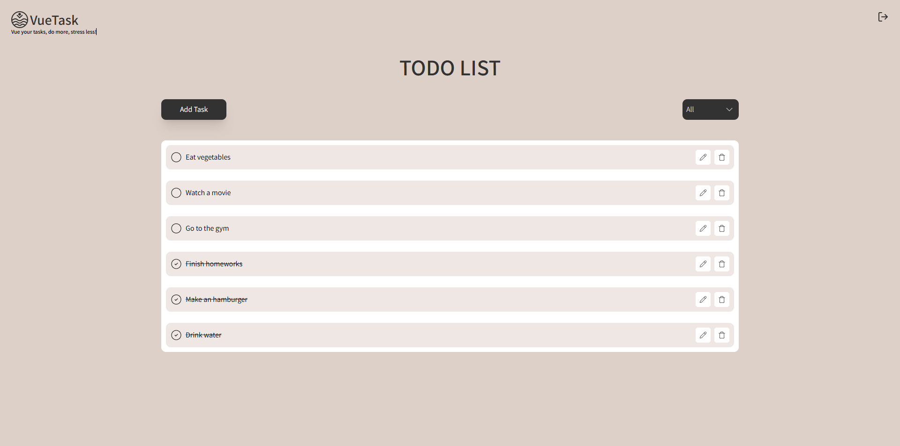

# VueTask

VueTask is a simple yet powerful to-do list application that demonstrates my expertise in web development with Vue.js. This project highlights essential features that streamline task management and enhance user experience, making it a practical tool for organizing and tracking daily tasks efficiently.

Features
* User Account Creation: Users can create and manage their own accounts.
* Task Management: Add, edit, delete, or update tasks as needed.
* Task Filtering: Filter tasks by status (completed or pending) to easily manage and view them.
* Secure Authentication: A backend handles user sessions, ensuring secure login and access.
* API Integration: Robust API routes for seamless interaction between the frontend and backend.
* Responsive Design: A mobile-friendly interface for easy task management on any device.
* Task Status Tracking: Mark tasks as completed or pending for better organization.

# Project Preview

# Technologies
* Docker: For containerization, enabling consistent development, testing, and deployment environments across platforms.
* Vue 3: A progressive JavaScript framework for building modern, reactive user interfaces with a focus on performance and simplicity.
* Fastify: A high-performance web framework for Node.js, used to build APIs with low overhead and minimal latency.
* Supabase: An open-source backend-as-a-service platform, offering real-time databases, authentication, and storage solutions for modern web applications.